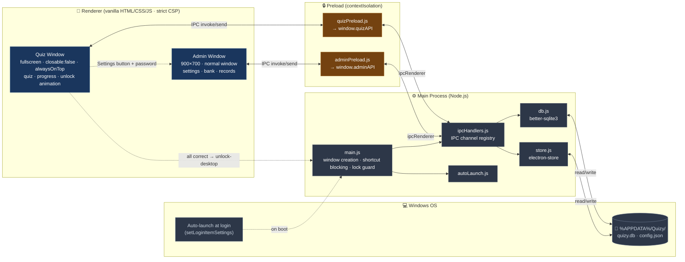

# Quizy — Boot-Time Quiz Lockscreen for Kids

[](./package.json)
[](https://www.electronjs.org/)
[](https://nodejs.org/)
[](#)
[](https://github.com/WiseLibs/better-sqlite3)
[](./LICENSE)

**Language / 语言**：[简体中文](./README.md) · **English**

> A Windows desktop app for elementary-school children. The PC auto-launches Quizy at login into a full-screen lockscreen; the child must correctly answer a configured number of **Chinese (语文)** and **Math (数学)** questions before the desktop is unlocked. Parents reach an admin UI through the bottom-right **Settings** button + password gate to manage grade, daily quota, password, question bank, and answer history.

- **Platform**: Windows 10/11 (x64)
- **Stack**: Electron 33 + better-sqlite3 11 + electron-store 8 + vanilla HTML/CSS/JS
- **Storage**: 100% local (SQLite + electron-store) — no network
- **Default admin password**: `123456` (change it on first launch)
- **Status**: All P0/P1 tasks complete — `npm run dev` and `npm run build` are ready to go

---

## Architecture Overview

Quizy follows the classic Electron three-tier design. The **main process** owns system resources and data access; the **preload bridge** exposes a whitelisted API via `contextBridge`; the **renderer** can only call sanctioned channels and cannot touch Node directly.

> The mermaid source below renders inline on GitHub / GitLab / VS Code and other mermaid-aware viewers. For viewers without mermaid support, see the offline PNG fallback: [`docs/architecture.en.png`](./docs/architecture.en.png) (source: [`docs/architecture.en.mmd`](./docs/architecture.en.mmd)).



**Hard rules**:
- Renderer runs under `contextIsolation: true` + `nodeIntegration: false` — it can **only** call `quizAPI` / `adminAPI` exposed by preload.
- Any new feature requires synchronized edits in **3 places**: preload (expose method) + ipcHandlers (register channel) + main-process module.
- The Quiz window's `close` / `blur` listeners are load-bearing for lockscreen integrity — **do not remove**.

---

## 1. Project Summary

### 1.1 Product Goals
- **Hard lock**: Auto-launch fullscreen at login; block `Alt+F4` / `Ctrl+W` / `Ctrl+R` / `F5` / `F11`; prevent focus-loss escape. The child cannot bypass.
- **Friendly UX**: Starry-night background, star-based progress, instant feedback (sound + animation) — rewards rather than punishes learning.
- **Configurable**: Grade, daily quotas (Chinese / Math), admin password, and the question bank are all managed by the parent in the admin UI.
- **Lightweight & local**: Everything (bank, config, records) lives on disk. No network calls.

### 1.2 End-to-End Flow

```
Boot
 └─> Quizy auto-launches (fullscreen / alwaysOnTop / closable:false)
      └─> Renders the Quiz page (top progress + Chinese/Math tabs + question card)
           ├─> Correct: ⭐ awarded + correct.mp3
           ├─> Wrong:   shake + reveal answer + wrong.mp3
           └─> Both subjects met
                └─> "Unlocked" celebration → IPC `unlock-desktop` → main window closes

[Admin entry]
 Bottom-right Settings button → password modal → admin UI
```

### 1.3 Architectural Decisions (Non-negotiable)

| Decision | Why |
| --- | --- |
| `contextIsolation: true` + `nodeIntegration: false` + Preload bridge | Renderer is isolated from Node; only `window.quizAPI` / `window.adminAPI` are reachable |
| CSP `default-src 'self'` | No CDN scripts, no remote fonts, no remote images |
| No frontend framework / no bundler | Renderer stays vanilla — zero build step |
| Admin password stored plaintext in `electron-store` | Accepted threat model for a home PC; do not log it, do not hash without coordination |
| Idempotent seed import | `seedIfEmpty()` only runs when `questions` table is empty — upgrades never overwrite |

---

## 2. Directory Layout

```
Quizy/
├── CLAUDE.md                       # AI-collaborator constraints
├── DEVELOPMENT_TASKS.md            # Detailed task list & acceptance criteria
├── README.md                       # Chinese README
├── README.en.md                    # This file (English README)
├── LICENSE                         # MIT license
├── package.json                    # Deps, scripts, electron-builder config
├── .gitignore                      # node_modules / dist / *.db*
├── start.bat                       # One-click Windows dev launcher (= npm run dev)
│
├── docs/                           # Docs & diagrams
│   ├── architecture.mmd            # Architecture diagram source (zh)
│   ├── architecture.png            # Architecture diagram render (zh)
│   ├── architecture.en.mmd         # Architecture diagram source (en)
│   └── architecture.en.png         # Architecture diagram render (en)
│
├── src/
│   ├── main/                       # Electron main process
│   │   ├── main.js                 # Entry: windows / shortcut traps / IPC + emergency-quit
│   │   ├── db.js                   # better-sqlite3 wrapper + closeDb + test env injection
│   │   ├── store.js                # electron-store wrapper (initStore accepts options)
│   │   ├── autoLaunch.js           # Login-item registration (auto-skipped in dev)
│   │   └── ipcHandlers.js          # Unified IPC channel registry
│   │
│   ├── preload/                    # Preload scripts (contextBridge surface)
│   │   ├── quizPreload.js          # Exposes window.quizAPI
│   │   └── adminPreload.js         # Exposes window.adminAPI
│   │
│   └── renderer/                   # Renderer (two independent BrowserWindows)
│       ├── quiz/                   # Quiz / lockscreen window
│       │   ├── index.html
│       │   ├── quiz.css
│       │   └── quiz.js
│       └── admin/                  # Admin window
│           ├── index.html
│           ├── admin.css
│           └── admin.js            # Three-tab business logic (settings / bank / records)
│
├── data/
│   └── seed.json                   # Initial bank (72 questions); dev: repo root, prod: resourcesPath
│
├── assets/                         # T5: app icon + answer SFX (replaceable with your assets)
│   ├── icons/icon.ico              # Windows installer icon (256×256 multi-res)
│   └── sounds/
│       ├── correct.mp3             # Correct-answer SFX (< 1s, Mixkit preview clip)
│       └── wrong.mp3               # Wrong-answer SFX (< 1s, Mixkit preview clip)
│
└── test/                           # T7: regression tests on top of Node's node:test
    ├── db.test.js                  # Bank CRUD / random exclusion / records / seed import
    ├── store.test.js               # Defaults / read-write / schema validation
    └── fixtures/
        └── mini-seed.json          # Test-only mini seed (2 questions)
```

> **Runtime data (not in repo)**
> - SQLite database: `%APPDATA%\Quizy\quizy.db`
> - Config file: `%APPDATA%\Quizy\config.json` (managed by `electron-store`)

---

## 3. Feature Breakdown

### 3.1 Main Process (`src/main/`)

| File | Responsibility |
| --- | --- |
| `main.js` | Creates the **Quiz window** (fullscreen / `frame:false` / `closable:false` / `alwaysOnTop`); `close` listener blocks exit; `blur` listener re-grabs focus (**exception**: when the Admin window is open, focus is not re-stolen, so the admin UI is reachable); spawns the **Admin window** on demand (900×700, `alwaysOnTop`); registers no-op global shortcuts for `Alt+F4` / `Ctrl+W` / `Ctrl+R` / `F5` / `F11`; reacts to **`unlock-desktop`** (closes the lock window) and to the hidden **`emergency-quit`** (`Ctrl+Q` / `Cmd+Q` — quits the app, useful when truly stuck). |
| `db.js` | Initializes `quizy.db`, creates `questions` / `records` tables + indices; random question pick (with `excludeIds`), answer-record write/read, question CRUD, per-(subject, grade) counts; **exposes `closeDb()`**; supports test injection via env: `QUIZY_TEST_USERDATA` (overrides DB path), `QUIZY_SKIP_SEED` (skip seed import), `QUIZY_SEED_PATH` (custom seed file). |
| `store.js` | Uses `electron-store` for: `grade` (default 3), `adminPassword` (default `123456`), `unlockRequirements` (default `{chinese:5, math:5}`); `initStore(options?)` forwards `cwd` / `name` / `projectVersion`, enabling isolated test stores. |
| `autoLaunch.js` | Calls `app.setLoginItemSettings({openAtLogin:true})`; **auto-skipped in dev mode** to avoid polluting the developer's login items. |
| `ipcHandlers.js` | Registers all IPC channels (see §3.4). |

### 3.2 Quiz Window (`src/renderer/quiz/`)

| Element / Module | Behavior |
| --- | --- |
| Starry background (`#stars`) | JS spawns 80 `.star` nodes with CSS `twinkle` keyframes |
| Top progress (`#progress-area`) | Two columns — Chinese and Math, each `⭐`/`☆` row + numeric counter |
| Subject tabs (`#subject-tabs`) | Pill tabs; switching is disabled while answering |
| Question card (`#question-card`) | Shows grade/type chips + stem + options/blank/judge/image |
| Option buttons (`.option-btn`) | 4-of-1 (choice/image), 2-of-1 (judge), text input (fill) |
| Instant feedback (`#feedback`) | `⭐` on correct / `💔` on wrong, 0.8s scale-fade animation |
| Wrong-answer handling | Card `shake` + highlight correct option, auto-advance after 1.2s |
| Pass overlay (`#unlock-overlay`) | Shown when both quotas hit with a primary button; clicking it sends `unlock-desktop` and exits the app |
| Settings entry (`#settings-btn`) | Bottom-right **Settings** button — click opens the password modal |
| Admin modal (`#admin-modal`) | Password → `verifyPassword` → on success, `openAdmin` IPC opens the admin window |
| Bypass guards | Suppresses right-click menu, `F12` / `F5` / `F11`, `Ctrl+R` / `Ctrl+W` / `Ctrl+Q` |

### 3.3 Admin Window (`src/renderer/admin/`)

`admin.js` is implemented and bound to `window.adminAPI` exposed by `adminPreload`. The three tabs below (filters, form validation, CRUD, summaries) are all functional.

**Tab 1 · Basic Settings**
- Grade dropdown (1–6)
- Daily quotas for Chinese / Math (1–20)
- Change admin password (twice for confirmation; blank = unchanged)
- Bank stats grid `.stats-grid`: 6 grades × 2 subjects = 12 cards

**Tab 2 · Question Bank**
- Filters: subject / grade / type (`choice` / `judge` / `fill` / `image`)
- List: id, subject, grade, type, stem, answer, edit/delete buttons
- Add/edit form: dynamic fields based on type (4 options / judge / fill)
- Delete: `confirm()` second-step

**Tab 3 · Answer Records**
- Date dropdown (latest 30 distinct days from `getRecordDates()`)
- Summary: total / correct / accuracy / grouped by subject
- List: time, subject, question id, correct/wrong

### 3.4 IPC Contract

> The renderer can only call `window.quizAPI` / `window.adminAPI`. Adding a new method means editing **preload + ipcHandlers + business module** together.

| Channel | Caller | Purpose |
| --- | --- | --- |
| `get-config` | quiz / admin | Read config (grade / unlockRequirements / adminPassword) |
| `set-config` | admin | Set a single config key |
| `verify-password` | quiz | String-compare against `adminPassword` |
| `get-question` | quiz | Random question by `subject` + `grade` + `excludeIds` |
| `submit-answer` | quiz | Insert a row into `records` |
| `get-records` | admin | Records for a given date |
| `get-record-dates` | admin | Most recent 30 days with records |
| `get-all-questions` | admin | Question list (subject / grade / type filters) |
| `add-question` / `update-question` / `delete-question` | admin | Bank CRUD |
| `get-question-count` | admin | Count per (subject, grade) |
| `unlock-desktop` (send) | quiz | Tell main to close the lock window |
| `emergency-quit` (send) | quiz | Hidden emergency exit: `Ctrl+Q` / `Cmd+Q` sets the unlocked flag and calls `app.quit()` — registered directly in `main.js` |
| `open-admin-window` (send) | quiz | Tell main to spawn the admin window |

### 3.5 Data Model

**questions**
```
id          INTEGER PK AUTOINCREMENT
subject     TEXT     -- 'chinese' | 'math'
grade       INTEGER  -- 1..6
type        TEXT     -- 'choice' | 'judge' | 'fill' | 'image'
content     TEXT     -- question stem
options     TEXT     -- JSON string (choice/image only), NULL otherwise
answer      TEXT     -- correct answer text
image_path  TEXT     -- image questions only; relative path or file:// URL
```

**records**
```
id           INTEGER PK AUTOINCREMENT
date         TEXT     -- 'YYYY-MM-DD'
subject      TEXT
question_id  INTEGER
is_correct   INTEGER  -- 0 | 1
answered_at  TEXT     -- ISO timestamp
```

**seed.json** (array of objects)
```json
{
  "subject": "chinese",
  "grade": 3,
  "type": "choice",
  "content": "Which of the following has no typo?",
  "options": ["再接再厉", "再接再励", "再节再厉", "在接在厉"],
  "answer": "再接再厉",
  "image_path": null
}
```

---

## 4. Development & Running

### 4.1 Prerequisites
- Windows 10/11 x64
- Node.js 18+ (LTS 20 recommended)
- Visual Studio Build Tools with the **"Desktop development with C++"** workload — required to compile the native `better-sqlite3` module against Electron's ABI

### 4.2 Install

```bash
npm install
```

> `better-sqlite3` is rebuilt against Electron's ABI via a `postinstall` step. If it fails, you're usually missing Python / VS Build Tools — follow the npm error message. You can also rebuild explicitly with `npm run rebuild:electron`.

### 4.3 Dev Mode

```bash
npm run dev
```
- Sets `NODE_ENV=development`
- Opens detached DevTools
- **Does not** register auto-launch
- Reads seed from `<repo>/data/seed.json`
- Or just double-click `start.bat` on Windows for the same effect

### 4.4 Production-style Run (no installer)

```bash
npm start
```
- Registers auto-launch
- No DevTools
- Reads seed from `process.resourcesPath/data/seed.json` (exists only in packaged build)

### 4.5 Automated Tests (T7)

```bash
npm test
```

- Uses Node's built-in **`node:test`**; specs live in `test/db.test.js` and `test/store.test.js`.
- `npm test` runs Electron with **`ELECTRON_RUN_AS_NODE=1`** so that `better-sqlite3` is loaded with the same ABI it was compiled for (this avoids the classic "works under system Node, breaks under Electron" mismatch).
- `npm install` triggers **`postinstall`**: `cross-env CL=/std:c++20 electron-rebuild -f -w better-sqlite3` — rebuilds the native module against Electron 33's V8 using **C++20**. If it fails, manually run `npm run rebuild:electron`.
- DB tests honor **`QUIZY_TEST_USERDATA`** / **`QUIZY_SKIP_SEED`** / **`QUIZY_SEED_PATH`**, so they never touch the real `%APPDATA%\Quizy\`.
- Repo paths with **spaces** can occasionally trip up `node-gyp`; prefer a space-free directory (this repo's parent is `vibe_code`). If rebuilds keep failing, move the repo to a space-free path.

> Note: no Lint / formatter scripts are configured (intentionally).

---

## 5. Build & Release

### 5.1 NSIS Installer

```bash
npm run build
```
- Output: `dist/Quizy Setup <version>.exe`
- Installer behavior (from `package.json > build.nsis`):
  - Not one-click (user can choose install dir)
  - Creates desktop shortcut
  - Creates Start Menu shortcut
  - Runs after install

### 5.2 Quick Smoke Build (no installer)

```bash
npm run build:dir
```
Output: `dist/win-unpacked/` — double-click `Quizy.exe` to test.

### 5.3 Resource Packaging
- `package.json > build.files` includes `src/`, `assets/`, `data/`, `node_modules/`
- `package.json > build.extraResources` copies `data/` into `resourcesPath/data/`, accessed at runtime via `process.resourcesPath`

---

## 6. Roadmap (What's Left)

### ✅ Done
- All main-process modules (`main / db / store / autoLaunch / ipcHandlers`) — incl. `emergency-quit` IPC and `closeDb` for test teardown
- Both preload bridges (`quizPreload / adminPreload`)
- Quiz window: full HTML + CSS + JS
- Admin window: HTML + CSS + **`admin.js` (business logic)**
- **`data/seed.json`** (72 questions across grades 1–6 × Chinese/Math × four types)
- **`assets/`** (`icons/icon.ico` + `sounds/correct.mp3` / `wrong.mp3`)
- **`test/`** + **`npm test`** (`db` exclusion / records / seed; `electron-store` defaults / schema)
- `package.json` + `.gitignore` + `LICENSE`

### ⏳ Optional follow-ups

| Priority | Item | Note |
| --- | --- | --- |
| — | Extra tests | E.g. IPC integration tests, `admin.js` form-validation tests via jsdom |
| — | More questions | The seed contains ≥ 6 questions per (subject, grade); expand via the admin UI as needed |

---

## 7. Settings Entry & Default Credentials

| Item | Default | How to change |
| --- | --- | --- |
| Admin password | `123456` | Admin UI · Basic Settings tab |

**Steps**: click the bottom-right **Settings** button → password modal → correct password → admin window opens. The admin window coexists with the lock window; closing it refocuses the lock screen.

---

## 8. FAQ

**Q1: Forgot the admin password — what now?**
A: From another Windows account or safe mode, delete or edit the `adminPassword` field in `%APPDATA%\Quizy\config.json`. Restart Quizy and the default `123456` is restored.

**Q2: The bank is empty and the kid can't answer anything.**
A: Verify that `data/seed.json` exists (the repo ships with one). If you manually wiped the DB or the bank already has rows, the seed will not re-import — add questions via the admin UI, or wipe `%APPDATA%\Quizy\quizy.db` and restart to trigger first-time import again (you'll lose existing records).

**Q3: Stuck on the lock screen with no way out.**
A: On the quiz page, press **`Ctrl+Q`** (`Cmd+Q` on macOS) to trigger the hidden emergency exit — the main process will quit the app. (Do not tell the child.) If that fails, `Ctrl+Alt+Del` opens Task Manager (system-level, not intercepted) — kill `Quizy.exe`.

**Q4: NSIS warns about "missing icon" during build.**
A: Make sure `assets/icons/icon.ico` exists and `package.json > build.win.icon` points to it. The repo ships with a placeholder ICO — swap it for your own brand artwork if desired.

**Q5: No sound when answering.**
A: The repo ships `assets/sounds/*.mp3`. Audio is triggered by the user's click, so Chromium's autoplay policy normally doesn't block it. If silent, check system volume, that the files are present, and DevTools for `NotAllowedError`.

**Q6: I don't want auto-launch during development.**
A: Use `npm run dev` — `autoLaunch.js` skips registration whenever `NODE_ENV=development`.

**Q7: `npm run dev` crashes with `NODE_MODULE_VERSION` / `better_sqlite3.node was compiled against a different Node.js version`.**
A: This means `better-sqlite3` is currently built for the system Node, but Electron ships its own Node ABI. Run **`npm run rebuild:electron`** in the repo root (the `postinstall` step also tries this automatically). You need the **"Desktop development with C++"** workload installed. If it still fails, open **"Developer PowerShell for VS"** or **"x64 Native Tools Command Prompt"** from the Start menu and run the same command there.

**Q7b: `postinstall` / `electron-rebuild` reports `unsupported version: 18`, `unknown version`, or `C++20 or later required`.**
A: **VS 2026** (internal major version 18) is only recognized by recent **node-gyp**, and **Electron 33's V8 headers require C++20** to compile native modules. The repo already handles this three ways: (1) `package.json` `overrides` swaps `@electron/rebuild`'s bundled `@electron/node-gyp` for upstream `node-gyp@11.5.0` (recognizes VS 2026 *and* supports Node 18); (2) `postinstall` / `rebuild:electron` set `CL=/std:c++20`; (3) we pin **`better-sqlite3@^11`**, which is friendlier to the current toolchain. Re-run **`npm install`** after pulling. If `py.exe` is `ENOENT`, point npm at a real Python: `npm config set python "C:\ProgramData\miniconda3\python.exe"`. Paths with spaces can still confuse `node-gyp` — prefer a space-free location. Optional: `Install-Module VSSetup -Scope CurrentUser` improves VS detection.

---

## 9. Hard Constraints (Do Not Break)

1. **Lockscreen integrity**: do not relax `closable: false`, do not remove the `blur → focus` listener, do not add any "exit" affordance to the quiz UI. The only legitimate exit is completing the quiz.
2. **Strict CSP**: no external scripts/fonts/images. Place new static assets under `assets/` or `src/renderer/` and reference them relatively.
3. **No framework**: keep the renderer vanilla, with no build step.
4. **Idempotent seed**: do not add "re-import on upgrade" logic. Add new content through the admin UI.
5. **Enum consistency**: `subject ∈ {chinese, math}` · `grade ∈ {1..6}` · `type ∈ {choice, judge, fill, image}`. The DB has no constraints — code enforces this.
6. **Shortcut blocklist**: `Alt+F4` / `Ctrl+W` / `Ctrl+R` / `F5` / `F11` is **append-only** — never shorten.

---

## 10. Reference Docs

- Architectural constraints & guardrails: [`CLAUDE.md`](./CLAUDE.md)
- Detailed task list & acceptance criteria: [`DEVELOPMENT_TASKS.md`](./DEVELOPMENT_TASKS.md)
- Architecture diagram source: [`docs/architecture.en.mmd`](./docs/architecture.en.mmd) | rendered PNG: [`docs/architecture.en.png`](./docs/architecture.en.png)
- License: [`LICENSE`](./LICENSE) (MIT)

> Version: v1.0 · Updated: 2026-05-12
