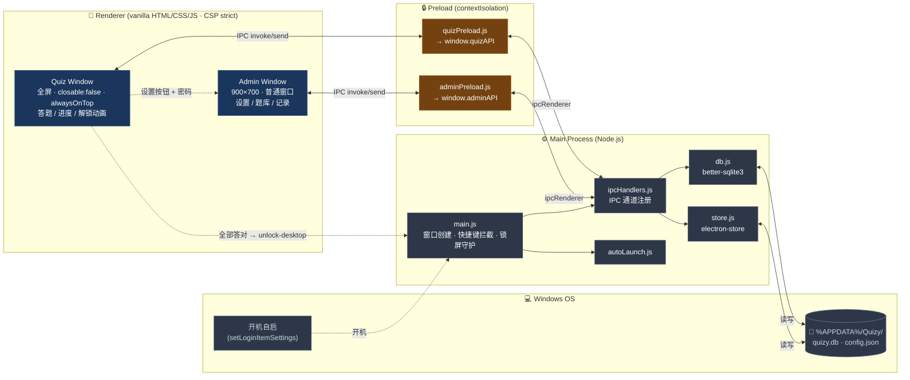

# Quizy — 儿童开机锁屏答题软件

[](./package.json)
[](https://www.electronjs.org/)
[](https://nodejs.org/)
[](#)
[](https://github.com/WiseLibs/better-sqlite3)
[](./LICENSE)

**Language / 语言**：**简体中文** · [English](./README.en.md)

> 一款面向小学生的 Windows 桌面应用：开机即以全屏锁屏方式启动，孩子必须答对每日规定数量的 **语文 / 数学** 题目，才能解锁桌面进入正常使用。家长（管理员）通过右下角「设置」+ 密码进入后台，配置年级、题量、密码并管理题库、查看答题记录。

- **平台**：Windows 10/11（64 位）
- **技术栈**：Electron 33 + better-sqlite3 11 + electron-store 8 + 原生 HTML/CSS/JS
- **数据存储**：全本地（SQLite + electron-store），无任何网络调用
- **默认管理员密码**：`123456`（首次启动后请立即修改）
- **状态**：所有 P0/P1 任务已完成，可直接 `npm run dev` 或 `npm run build` 出包

---

## 架构总览

Quizy 采用 Electron 经典三层结构。**主进程**持有系统资源与数据访问；**Preload 桥**通过 `contextBridge` 暴露白名单 API；**渲染层**只能调用受控通道，无法直接接触 Node。

> 下面的 mermaid 源码在 GitHub / GitLab / VS Code 等支持 mermaid 的渲染器中可直接显示。如果你的查看器不支持 mermaid，也可以查看离线 PNG 版本：[`docs/architecture.png`](./docs/architecture.png)（源文件：[`docs/architecture.mmd`](./docs/architecture.mmd)）。



**关键约束**：
- 渲染层 `contextIsolation: true` + `nodeIntegration: false`，**只能**通过 Preload 暴露的 `quizAPI` / `adminAPI` 调用
- 添加新功能必须 **同步改 3 处**：Preload（暴露方法）+ ipcHandlers（注册通道）+ 主进程业务模块
- Quiz 窗口的 `close` / `blur` 监听器是锁屏完整性的核心，**禁止**移除

---

## 一、项目概要

### 1.1 产品目标
- **强约束**：开机即锁屏、屏蔽 `Alt+F4` / `Ctrl+W` / `Ctrl+R` / `F5` / `F11` 等退出/刷新快捷键，禁止失焦绕过，孩子无法跳出。
- **趣味化**：星空背景 + 星星进度 + 答对/答错音效与动画，鼓励学习而非惩罚。
- **可配置**：年级、每日语文/数学题量、管理员密码、题库均由家长在后台维护。
- **轻量本地化**：所有数据（题库、配置、答题记录）保存在本地，无需联网。

### 1.2 核心交互流程

```
开机
 └─> Quizy 自启（全屏 / alwaysOnTop / closable:false）
      └─> 渲染答题页（顶部进度 + 语文/数学 Tab + 题目卡片）
           ├─> 答对：⭐ 加星 + correct.mp3
           ├─> 答错：抖动 + 高亮正确答案 + wrong.mp3
           └─> 语文/数学双双达标
                └─> "解锁成功"庆祝动画 → IPC `unlock-desktop` → 关闭主窗口

[管理员入口]
 右下角「设置」按钮 → 密码弹窗 → 进入管理后台
```

### 1.3 技术决策（务必遵守）

| 决策 | 原因 |
| --- | --- |
| `contextIsolation: true` + `nodeIntegration: false` + Preload 桥 | 渲染层与 Node 隔离，仅通过 `window.quizAPI` / `window.adminAPI` 访问受控 IPC |
| CSP `default-src 'self'` | 禁止任何 CDN、远程脚本、远程图片 |
| 不引入前端框架 / 构建工具 | 渲染层全部 vanilla HTML/CSS/JS，零构建步骤 |
| 主密码明文存于 `electron-store` | 接受的家庭威胁模型；不打日志，不做哈希除非协调 |
| 种子导入幂等 | `seedIfEmpty()` 仅在 `questions` 表为空时执行，升级不会覆盖 |

---

## 二、目录结构

```
Quizy/
├── CLAUDE.md                       # 给 AI 协作者的项目约束说明
├── DEVELOPMENT_TASKS.md            # 详细开发任务与验收清单（产品规格）
├── README.md                       # 本文档（中文版）
├── README.en.md                    # 英文版 README
├── LICENSE                         # MIT 许可证
├── package.json                    # 依赖、脚本、electron-builder 配置
├── .gitignore                      # 忽略 node_modules / dist / *.db*
├── start.bat                       # Windows 一键开发模式启动器（= npm run dev）
│
├── docs/                           # 文档与图表
│   ├── architecture.mmd            # 架构图 mermaid 源（中文）
│   ├── architecture.png            # 架构图渲染产物（中文）
│   ├── architecture.en.mmd         # 架构图 mermaid 源（英文）
│   └── architecture.en.png         # 架构图渲染产物（英文）
│
├── src/
│   ├── main/                       # Electron 主进程
│   │   ├── main.js                 # 入口：窗口/快捷键/IPC + 应急退出（emergency-quit）
│   │   ├── db.js                   # better-sqlite3 封装 + closeDb + 测试 env 注入
│   │   ├── store.js                # electron-store 封装（initStore 支持 options 注入）
│   │   ├── autoLaunch.js           # 开机自启动设置（dev 模式下自动跳过）
│   │   └── ipcHandlers.js          # 所有 IPC 通道的统一注册
│   │
│   ├── preload/                    # 预加载脚本（contextBridge 暴露 API）
│   │   ├── quizPreload.js          # 暴露 window.quizAPI
│   │   └── adminPreload.js         # 暴露 window.adminAPI
│   │
│   └── renderer/                   # 渲染层（两个独立 BrowserWindow）
│       ├── quiz/                   # 答题/锁屏窗口
│       │   ├── index.html
│       │   ├── quiz.css
│       │   └── quiz.js
│       └── admin/                  # 管理后台窗口
│           ├── index.html
│           ├── admin.css
│           └── admin.js            # 管理后台逻辑（三 Tab：设置 / 题库 / 记录）
│
├── data/
│   └── seed.json                   # 初始题库（72 道）；dev 读仓库根，prod 读 resourcesPath
│
├── assets/                         # T5：应用图标 + 答题反馈音效（可替换为自家素材）
│   ├── icons/icon.ico              # 打包用 Windows 图标（可换品牌图）
│   └── sounds/
│       ├── correct.mp3             # 答对短音效（Mixkit 预览素材，许可见 mixkit.co/license）
│       └── wrong.mp3               # 答错短音效（同上）
│
└── test/                           # T7：基础回归（基于 Node 内置 node:test）
    ├── db.test.js                  # 题库 CRUD / 抽题排重 / 记录 / 种子导入
    ├── store.test.js               # 默认值 / 读写 / schema 校验
    └── fixtures/
        └── mini-seed.json          # 测试专用迷你种子（2 道题）
```

> **运行时数据位置**（不在仓库内）
> - SQLite 数据库：`%APPDATA%\Quizy\quizy.db`
> - 配置文件：`%APPDATA%\Quizy\config.json`（由 `electron-store` 管理）

---

## 三、功能说明

### 3.1 主进程（`src/main/`）

| 文件 | 功能 |
| --- | --- |
| `main.js` | 创建 **Quiz 窗口**（全屏/frame:false/closable:false/alwaysOnTop）；`close` 监听阻止退出，`blur` 监听抢回前台（**例外**：当 Admin 窗口存在时不再 refocus，避免抢占后台焦点）；按需创建 **Admin 窗口**（900×700 alwaysOnTop）；注册 `Alt+F4`/`Ctrl+W`/`Ctrl+R`/`F5`/`F11` 空处理；接收 **`unlock-desktop`** 关窗，接收隐藏的 **`emergency-quit`**（`Ctrl+Q`/`Cmd+Q`）触发应急退出 |
| `db.js` | 初始化 `quizy.db`，建表 `questions` / `records` + 索引；随机抽题（支持 `excludeIds`）、答题记录读写、题目 CRUD、按科目+年级计数；**暴露 `closeDb()`**；支持测试注入：`QUIZY_TEST_USERDATA`（数据库路径覆盖）、`QUIZY_SKIP_SEED`（跳过种子）、`QUIZY_SEED_PATH`（指定种子文件） |
| `store.js` | 用 `electron-store` 管理：`grade`（默认 3）、`adminPassword`（默认 `123456`）、`unlockRequirements`（默认 `{chinese:5, math:5}`）；`initStore(options?)` 透传 `cwd`/`name`/`projectVersion`，便于测试隔离 |
| `autoLaunch.js` | 调用 `app.setLoginItemSettings({openAtLogin:true})`；**dev 模式下自动跳过**，避免污染开发者的登录项 |
| `ipcHandlers.js` | 注册所有 IPC 通道（见 3.4） |

### 3.2 答题窗口（`src/renderer/quiz/`）

| 元素 / 模块 | 功能 |
| --- | --- |
| 星空背景 (`#stars`) | JS 动态生成 80 个 `.star`，CSS `twinkle` 关键帧闪烁 |
| 顶部进度区 (`#progress-area`) | 左右两栏分别显示语文/数学进度（`⭐`/`☆`）+ `已答对/总数` 数字 |
| 科目切换 (`#subject-tabs`) | 标签页风格，点击切换当前科目；答题中禁切换 |
| 题目卡片 (`#question-card`) | 显示年级/题型标签 + 题干 + 选项/填空/判断/图片 |
| 选项按钮 (`.option-btn`) | 4 选 1（选择题/看图题）、2 选 1（判断题）、文本输入（填空题） |
| 即时反馈 (`#feedback`) | 答对显示 `⭐`、答错显示 `💔`，0.8s 缩放淡出动画 |
| 错题处理 | 卡片 `shake` 抖动 + 高亮正确答案，1.2s 后自动加载下一题 |
| 通过遮罩 (`#unlock-overlay`) | 双科目都达标时显示通过祝贺文案与按钮「结束锁屏，进入桌面」，点击后 IPC `unlock-desktop` 退出应用 |
| 设置入口 (`#settings-btn`) | 右下角「⚙️ 设置」按钮，单击触发密码弹窗 |
| 管理员弹窗 (`#admin-modal`) | 密码输入 → `verifyPassword` → 通过则 `openAdmin` 打开后台窗口 |
| 防绕过 | 屏蔽右键菜单、`F12`/`F5`/`F11`、`Ctrl+R`/`Ctrl+W`/`Ctrl+Q` |

### 3.3 管理后台（`src/renderer/admin/`）

`admin.js` 已实现，与 `adminPreload` 暴露的 `window.adminAPI` 对接：三个 Tab 的筛选、表单校验、增删改查与答题记录汇总均可使用。

**Tab 1 · 基础设置**
- 年级下拉（1–6）
- 每日语文/数学需答对题数（1–20）
- 修改管理员密码（两次确认，留空表示不修改）
- 题库统计 `.stats-grid`：6 年级 × 2 科目 = 12 张统计卡

**Tab 2 · 题库管理**
- 筛选：科目 / 年级 / 类型（`choice` / `judge` / `fill` / `image`）
- 列表：编号、科目、年级、类型、题干、答案、编辑/删除按钮
- 新增/编辑表单：根据题型动态切换"4 选项 / 判断 / 填空"输入
- 删除：`confirm()` 二次确认

**Tab 3 · 答题记录**
- 日期下拉（取自 `getRecordDates()` 最近 30 天）
- 汇总：总题数、正确数、正确率、按科目分组
- 列表：时间、科目、题目 ID、对/错

### 3.4 IPC 通道契约

> 渲染层只能通过 preload 暴露的 `window.quizAPI` / `window.adminAPI` 调用，新增功能需 **同时改动 preload + ipcHandlers + 对应模块** 三处。

| 通道名 | 来源 | 用途 |
| --- | --- | --- |
| `get-config` | quiz / admin | 读取配置（grade / unlockRequirements / adminPassword） |
| `set-config` | admin | 设置单项配置 |
| `verify-password` | quiz | 字符串比对管理员密码 |
| `get-question` | quiz | 按 subject + grade + excludeIds 随机抽题 |
| `submit-answer` | quiz | 记录一次答题（写入 `records` 表） |
| `get-records` | admin | 查询某日答题记录 |
| `get-record-dates` | admin | 获取最近 30 天有记录的日期 |
| `get-all-questions` | admin | 题库列表（支持 subject/grade/type 过滤） |
| `add-question` / `update-question` / `delete-question` | admin | 题库增改删 |
| `get-question-count` | admin | 按 subject + grade 计数 |
| `unlock-desktop`（send） | quiz | 通知主进程关闭锁屏窗口 |
| `emergency-quit`（send） | quiz | 隐藏应急：`Ctrl+Q` / `Cmd+Q` → 解锁标志后 `app.quit()`（注册于 `main.js`） |
| `open-admin-window`（send） | quiz | 通知主进程打开管理后台 |

### 3.5 数据模型

**questions** 表
```
id          INTEGER PK AUTOINCREMENT
subject     TEXT     -- 'chinese' | 'math'
grade       INTEGER  -- 1..6
type        TEXT     -- 'choice' | 'judge' | 'fill' | 'image'
content     TEXT     -- 题干
options     TEXT     -- JSON 字符串（仅 choice/image 用），其余为 NULL
answer      TEXT     -- 正确答案文本
image_path  TEXT     -- 仅 image 用，相对路径或 file:// URL
```

**records** 表
```
id           INTEGER PK AUTOINCREMENT
date         TEXT     -- 'YYYY-MM-DD'
subject      TEXT
question_id  INTEGER
is_correct   INTEGER  -- 0 | 1
answered_at  TEXT     -- ISO 时间戳
```

**seed.json**（数组，每项对应一条 question）
```json
{
  "subject": "chinese",
  "grade": 3,
  "type": "choice",
  "content": "下列词语中没有错别字的一项是？",
  "options": ["再接再厉", "再接再励", "再节再厉", "在接在厉"],
  "answer": "再接再厉",
  "image_path": null
}
```

---

## 四、开发与运行

### 4.1 环境要求
- Windows 10/11 x64
- Node.js 18+ （推荐 20 LTS）
- 已安装 Visual Studio Build Tools 或 `windows-build-tools`（用于编译 `better-sqlite3` 原生模块）

### 4.2 安装依赖

```bash
npm install
```

> `better-sqlite3` 会针对 Electron 的 ABI 编译。若失败，多半是缺 Python / VS Build Tools；按 npm 报错提示安装即可。

### 4.3 开发模式

```bash
npm run dev
```
- `NODE_ENV=development`
- 自动打开 DevTools（detached 模式）
- **不**触发开机自启注册
- 种子文件从 `<repo>/data/seed.json` 读取

### 4.4 生产模式（不打包，直接跑）

```bash
npm start
```
- 触发开机自启注册
- 不打开 DevTools
- 种子文件从 `process.resourcesPath/data/seed.json` 读取（仅打包后存在）

### 4.5 自动化测试（T7）

```bash
npm test
```

- 使用 Node 内置 **`node:test`**，用例为 `test/db.test.js`、`test/store.test.js`。
- **`npm test` 通过 `ELECTRON_RUN_AS_NODE=1` 调用 Electron**，与 **`better-sqlite3` 针对 Electron 编译的 ABI** 一致（避免「系统 Node 能用、Electron 报错」）。
- 安装依赖后会执行 **`postinstall`**：`cross-env CL=/std:c++20 electron-rebuild -f -w better-sqlite3`（为 Electron 33 / V8 使用 **C++20** 编译）。请已安装 **「使用 C++ 的桌面开发」** 或 Build Tools；若失败可手动执行 `npm run rebuild:electron`。
- 数据库用例使用 **`QUIZY_TEST_USERDATA`**、**`QUIZY_SKIP_SEED`** 等环境变量，不写入真实 `%APPDATA%`。
- 若项目路径含**空格**，个别环境下 `node-gyp` 可能告警；建议使用无空格目录（例如本仓库父目录已使用 `vibe_code`）。若重建反复失败，可将仓库移到无空格路径再试。

> 说明：本仓库**没有**配置 Lint/格式化脚本。

---

## 五、打包与发布

### 5.1 生成 NSIS 安装包

```bash
npm run build
```
- 产物：`dist/Quizy Setup <version>.exe`
- 安装包特性（来自 `package.json > build.nsis`）：
  - 非一键安装（用户可选目录）
  - 创建桌面快捷方式
  - 创建开始菜单项
  - 安装完成后自动运行

### 5.2 快速冒烟测试构建（不打包安装器）

```bash
npm run build:dir
```
产物：`dist/win-unpacked/`，直接双击 `Quizy.exe` 验证。

### 5.3 资源打入说明
- `package.json > build.files` 包含 `src/`、`assets/`、`data/`、`node_modules/`
- `package.json > build.extraResources` 把 `data/` 复制到 `resourcesPath/data/`，运行时通过 `process.resourcesPath` 访问种子

---

## 六、当前进度与待完成项

### ✅ 已完成
- 主进程全部模块（`main / db / store / autoLaunch / ipcHandlers`）
- 两个 preload 桥（`quizPreload / adminPreload`）
- 答题窗口完整 HTML + CSS + JS
- 管理后台 HTML + CSS + **`admin.js`（业务逻辑）**
- **`data/seed.json`**（示例题库：各年级语文/数学各 6 题，覆盖四种题型；仅题库为空时导入一次）
- **`assets/`**（`icons/icon.ico` + `sounds/correct.mp3` / `wrong.mp3`，满足打包与答题音效）
- `package.json` + `.gitignore`
- **`test/`** + **`npm test`**（`db` 抽题/记录/种子、`electron-store` 配置与 schema）

### ⏳ 待完成（按优先级）

| 优先级 | 文件 | 说明 |
| --- | --- | --- |
| — | （可选）扩展测试 | 如 IPC 集成、`admin.js` 校验（可配合 jsdom）等 |

---

## 七、设置入口与默认凭据

| 项 | 默认值 | 修改方式 |
| --- | --- | --- |
| 管理员密码 | `123456` | 后台"基础设置"Tab |

**操作步骤**：在锁屏页右下角点击「⚙️ 设置」→ 弹出密码框 → 输入正确密码 → 自动打开管理后台窗口。后台与锁屏并存，关闭后台会自动重新聚焦锁屏。

---

## 八、常见问题（FAQ）

**Q1：忘记管理员密码怎么办？**
A：在另一可访问的 Windows 账户或安全模式下，删除/编辑 `%APPDATA%\Quizy\config.json` 中的 `adminPassword` 字段，重启 Quizy 即恢复默认 `123456`。

**Q2：题库为空，孩子答不了题？**
A：确认仓库内存在 `data/seed.json`（本仓库已附带示例种子）。若曾手动删库或题库已有数据，种子不会重复导入，请在管理后台「题库管理」中新增题目，或清空 `%APPDATA%\Quizy\quizy.db` 后重启以重新触发首次导入（会丢失已有记录）。

**Q3：锁屏卡死、无法解锁？**
A：在**答题全屏页**连按 **`Ctrl+Q`**（macOS 为 **`Cmd+Q`**）可触发隐藏应急退出（主进程会结束应用；勿让孩子知晓）。仍无法退出时，可按 `Ctrl+Alt+Del` 打开任务管理器强制结束 `Quizy.exe`。

**Q4：打包报"missing icon"警告？**
A：确认 `assets/icons/icon.ico` 存在且 `package.json > build.win.icon` 路径正确；若已删除该文件，请补回或改用自有 `.ico`。

**Q5：音效不响？**
A：仓库已包含 `assets/sounds/*.mp3`。答题由点击触发播放，一般不受自动播放策略影响；若仍无声，检查系统音量、文件是否被误删、以及 DevTools 是否出现 `NotAllowedError`。

**Q6：开发期间不想被自启动？**
A：使用 `npm run dev`（`NODE_ENV=development`），`autoLaunch.js` 会自动跳过注册。

**Q7：`npm run dev` 报错 `NODE_MODULE_VERSION` / `better_sqlite3.node was compiled against a different Node.js version`？**
A：说明 `better-sqlite3` 当前是按**系统 Node**编的，而 **Electron 自带另一套 Node ABI**。请在项目根目录执行 **`npm run rebuild:electron`**（安装依赖时 `postinstall` 也会尝试执行）。需已安装 **「使用 C++ 的桌面开发」** 工作负载；若仍失败，在开始菜单打开 **「Developer PowerShell for VS」** 或 **「x64 Native Tools Command Prompt」** 再执行同一命令。

**Q7b：`postinstall` / `electron-rebuild` 报 `unsupported version: 18`、`unknown version`、或 `C++20 or later required`？**  
A：**VS 2026（内部主版本 18）** 需要较新的 **node-gyp** 才能被识别；**Electron 33** 自带的 V8 头文件则要求用 **C++20** 编译原生模块。本仓库已做三处处理：（1）`package.json` 的 **`overrides`** 把 `@electron/rebuild` 自带的 **`@electron/node-gyp` 换成官方 `node-gyp@11.5.0`**（识别 VS 2026，且支持 Node 18）；（2）`postinstall` / `rebuild:electron` 前设置 **`CL=/std:c++20`**；（3）依赖 **`better-sqlite3@^11`**，与当前 Electron 工具链更匹配。请重新执行 **`npm install`**。若 **`py.exe` ENOENT**，可配置：`npm config set python "C:\ProgramData\miniconda3\python.exe"`。路径含空格时 `node-gyp` 可能告警，尽量使用无空格目录。可选：`Install-Module VSSetup -Scope CurrentUser` 改善 VS 检测。

---

## 九、关键约束（请勿破坏）

1. **锁屏完整性**：不要放宽 `closable:false`、不要移除 `blur → focus` 监听、不要给 quiz 页面增加任何"退出"入口。唯一合法出口是答题完成。
2. **CSP 严格**：禁止外链脚本/字体/图片；新增静态资源必须放在 `assets/` 或 `src/renderer/` 下用相对路径引用。
3. **不引入框架**：保持渲染层为 vanilla JS，无构建步骤。
4. **种子幂等**：不要写"升级时重新导入"的逻辑；增量内容请通过后台手动添加。
5. **枚举一致性**：`subject ∈ {chinese, math}`、`grade ∈ {1..6}`、`type ∈ {choice, judge, fill, image}`——数据库未加约束，靠代码保证。
6. **快捷键拦截**：`Alt+F4` / `Ctrl+W` / `Ctrl+R` / `F5` / `F11` 拦截列表**只可增不可减**。

---

## 十、参考文档

- 项目约束与架构详解：[`CLAUDE.md`](./CLAUDE.md)
- 详细任务清单与验收标准：[`DEVELOPMENT_TASKS.md`](./DEVELOPMENT_TASKS.md)
- 架构图源文件：[`docs/architecture.mmd`](./docs/architecture.mmd) ｜ 渲染产物：[`docs/architecture.png`](./docs/architecture.png)
- 开源许可：[`LICENSE`](./LICENSE)（MIT）

> 版本：v1.0 · 更新日期：2026-05-12
